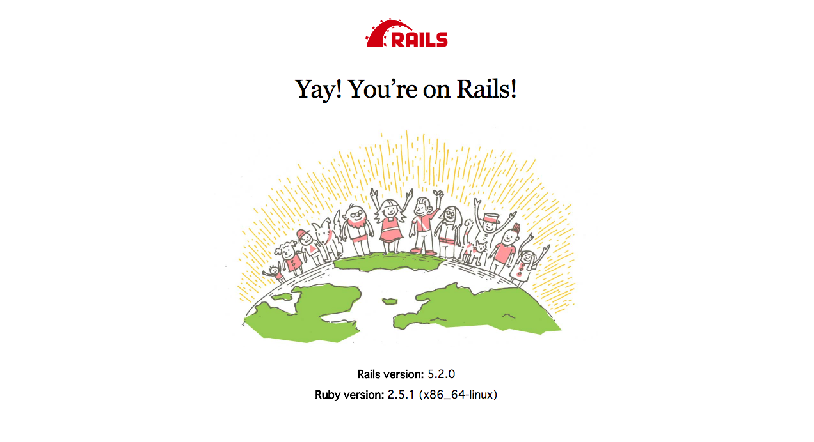

# README

This README would normally document whatever steps are necessary to get the
application up and running.

Things you may want to cover:

* Ruby version

* System dependencies

* Configuration

* Database creation

* Database initialization

* How to run the test suite

* Services (job queues, cache servers, search engines, etc.)

* Deployment instructions

* ...

<section class="section">

# Quickstart: Compose and Rails

Estimated reading time: 8 minutes

This Quickstart guide shows you how to use Docker Compose to set up and run a Rails/PostgreSQL app. Before starting, [install Compose](https://docs.docker.com/compose/install/).

### Define the project

Start by setting up the four files needed to build the app. First, since your app is going to run inside a Docker container containing all of its dependencies, define exactly what needs to be included in the container. This is done using a file called `Dockerfile`. To begin with, the Dockerfile consists of:

    FROM ruby:2.5
    RUN apt-get update -qq && apt-get install -y build-essential libpq-dev nodejs
    RUN mkdir /myapp
    WORKDIR /myapp
    COPY Gemfile /myapp/Gemfile
    COPY Gemfile.lock /myapp/Gemfile.lock
    RUN bundle install
    COPY . /myapp

That’ll put your application code inside an image that builds a container with Ruby, Bundler and all your dependencies inside it. For more information on how to write Dockerfiles, see the [Docker user guide](https://docs.docker.com/engine/tutorials/dockerimages/#building-an-image-from-a-dockerfile) and the [Dockerfile reference](https://docs.docker.com/engine/reference/builder/).

Next, create a bootstrap `Gemfile` which just loads Rails. It’ll be overwritten in a moment by `rails new`.

    source 'https://rubygems.org'
    gem 'rails', '5.2.0'

Create an empty `Gemfile.lock` to build our `Dockerfile`.

    touch Gemfile.lock

Finally, `docker-compose.yml` is where the magic happens. This file describes the services that comprise your app (a database and a web app), how to get each one’s Docker image (the database just runs on a pre-made PostgreSQL image, and the web app is built from the current directory), and the configuration needed to link them together and expose the web app’s port.

    version: '3'
    services:
      db:
        image: postgres
        volumes:
          - ./tmp/db:/var/lib/postgresql/data
      web:
        build: .
        command: bundle exec rails s -p 3000 -b '0.0.0.0'
        volumes:
          - .:/myapp
        ports:
          - "3000:3000"
        depends_on:
          - db

> **Tip**: You can use either a `.yml` or `.yaml` extension for this file.

### Build the project

With those four files in place, you can now generate the Rails skeleton app using [docker-compose run](https://docs.docker.com/compose/reference/run/):

    docker-compose run web rails new . --force --database=postgresql

First, Compose builds the image for the `web` service using the `Dockerfile`. Then it runs `rails new` inside a new container, using that image. Once it’s done, you should have generated a fresh app.

List the files.

    $ ls -l
    total 72
    -rw-r--r-- 1 vmb staff 223 5 26 14:20 Dockerfile
    -rw-r--r-- 1 vmb staff 2223 5 26 14:24 Gemfile
    -rw-r--r-- 1 vmb staff 5300 5 26 14:25 Gemfile.lock
    -rw-r--r-- 1 vmb staff 374 5 26 14:24 README.md
    -rw-r--r-- 1 vmb staff 227 5 26 14:24 Rakefile
    drwxr-xr-x 10 vmb staff 320 5 26 14:24 app
    drwxr-xr-x 9 vmb staff 288 5 26 14:25 bin
    drwxr-xr-x 16 vmb staff 512 5 26 14:24 config
    -rw-r--r-- 1 vmb staff 130 5 26 14:24 config.ru
    drwxr-xr-x 3 vmb staff 96 5 26 14:24 db
    -rw-r--r-- 1 vmb staff 266 5 26 14:22 docker-compose.yml
    drwxr-xr-x 4 vmb staff 128 5 26 14:24 lib
    drwxr-xr-x 3 vmb staff 96 5 26 14:24 log
    -rw-r--r-- 1 vmb staff 63 5 26 14:24 package.json
    drwxr-xr-x 9 vmb staff 288 5 26 14:24 public
    drwxr-xr-x 3 vmb staff 96 5 26 14:24 storage
    drwxr-xr-x 11 vmb staff 352 5 26 14:24 test
    drwxr-xr-x 6 vmb staff 192 5 26 14:24 tmp
    drwxr-xr-x 3 vmb staff 96 5 26 14:24 vendor

If you are running Docker on Linux, the files `rails new` created are owned by root. This happens because the container runs as the root user. If this is the case, change the ownership of the new files.

    sudo chown -R $USER:$USER .

If you are running Docker on Mac or Windows, you should already have ownership of all files, including those generated by `rails new`.

Now that you’ve got a new Gemfile, you need to build the image again. (This, and changes to the `Gemfile` or the Dockerfile, should be the only times you’ll need to rebuild.)

    docker-compose build

### Connect the database

The app is now bootable, but you’re not quite there yet. By default, Rails expects a database to be running on `localhost` - so you need to point it at the `db` container instead. You also need to change the database and username to align with the defaults set by the `postgres` image.

Replace the contents of `config/database.yml` with the following:

    default: &default
      adapter: postgresql
      encoding: unicode
      host: db
      username: postgres
      password:
      pool: 5

    development:
      <<: *default
      database: myapp_development

    test:
      <<: *default
      database: myapp_test

You can now boot the app with [docker-compose up](https://docs.docker.com/compose/reference/up/):

    docker-compose up

If all’s well, you should see some PostgreSQL output, and then — after a few seconds — the familiar refrain:

    Starting rails_db_1 ...
    Starting rails_db_1 ... done
    Recreating rails_web_1 ...
    Recreating rails_web_1 ... done
    Attaching to rails_db_1, rails_web_1
    db_1   | LOG:  database system was shut down at 2017-06-07 19:12:02 UTC
    db_1   | LOG:  MultiXact member wraparound protections are now enabled
    db_1   | LOG:  database system is ready to accept connections
    db_1   | LOG:  autovacuum launcher started
    web_1  | => Booting Puma
    web_1  | => Rails 5.2.0 application starting in development
    web_1  | => Run `rails server -h` for more startup options
    web_1  | Puma starting in single mode...
    web_1  | * Version 3.11.4 (ruby 2.5.1-p57), codename: Love Song
    web_1  | * Min threads: 5, max threads: 5
    web_1  | * Environment: development
    web_1  | * Listening on tcp://0.0.0.0:3000
    web_1  | Use Ctrl-C to stop

Finally, you need to create the database. In another terminal, run:

    docker-compose run web rake db:create

Here is an example of the output from that command:

    vmb at snapair in ~/sandbox/rails
    $ docker-compose run web rake db:create
    Starting rails_db_1 ... done
    Created database 'myapp_development'
    Created database 'myapp_test'

### View the Rails welcome page!

That’s it. Your app should now be running on port 3000 on your Docker daemon.

On Docker for Mac and Docker for Windows, go to `http://localhost:3000` on a web browser to see the Rails Welcome.

If you are using [Docker Machine](https://docs.docker.com/machine/overview/), then `docker-machine ip MACHINE_VM` returns the Docker host IP address, to which you can append the port (`<Docker-Host-IP>:3000`).

### Stop the application

To stop the application, run [docker-compose down](https://docs.docker.com/compose/reference/down/) in your project directory. You can use the same terminal window in which you started the database, or another one where you have access to a command prompt. This is a clean way to stop the application.

    vmb at snapair in ~/sandbox/rails
    $ docker-compose down
    Stopping rails_web_1 ... done
    Stopping rails_db_1 ... done
    Removing rails_web_run_1 ... done
    Removing rails_web_1 ... done
    Removing rails_db_1 ... done
    Removing network rails_default

You can also stop the application with `Ctrl-C` in the same shell in which you executed the `docker-compose up`. If you stop the app this way, and attempt to restart it, you might get the following error:

    web_1 | A server is already
    running. Check /myapp/tmp/pids/server.pid.

To resolve this, delete the file `tmp/pids/server.pid`, and then re-start the application with `docker-compose up`.

### Restart the application

To restart the application run `docker-compose up` in the project directory.

### Rebuild the application

If you make changes to the Gemfile or the Compose file to try out some different configurations, you need to rebuild. Some changes require only `docker-compose up --build`, but a full rebuild requires a re-run of `docker-compose run web bundle install` to sync changes in the `Gemfile.lock` to the host, followed by `docker-compose up --build`.

Here is an example of the first case, where a full rebuild is not necessary. Suppose you simply want to change the exposed port on the local host from `3000` in our first example to `3001`. Make the change to the Compose file to expose port `3000` on the container through a new port, `3001`, on the host, and save the changes:

    ports: - "3001:3000"

Now, rebuild and restart the app with `docker-compose up --build`.

Inside the container, your app is running on the same port as before `3000`, but the Rails Welcome is now available on `http://localhost:3001` on your local host.

</section>